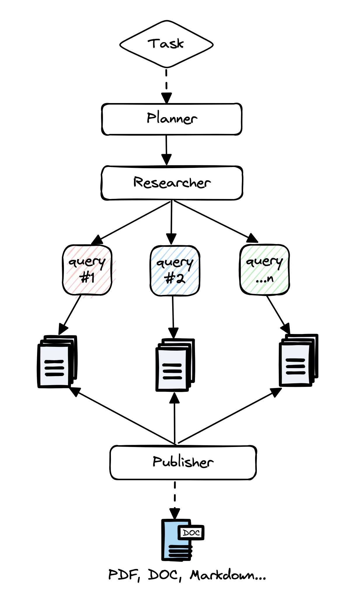

## 🤖 LangGraph AI Agents – Progetto basato sul corso Udemy

Questo repository contiene il mio progetto completo sviluppato durante il corso **[Develop LLM Powered AI Agents with LangGraph](https://www.udemy.com/course/langgraph/?couponCode=ST14MT150425G1)**. Il progetto è una dimostrazione pratica dell’uso di **LangGraph**, una potente estensione di **LangChain**, per costruire **workflow AI agent-based** complessi, modulari e scalabili.

### 📦 Obiettivo del progetto

L'obiettivo è mostrare come sviluppare **AI Agents orchestrati**, capaci di interagire in modo autonomo seguendo una logica strutturata. Il grafo definisce il comportamento degli agenti, i quali collaborano per risolvere compiti complessi (es. classificazione, ragionamento su documenti, scraping, produzione di report complessi ecc.).

---

### 📂 Struttura del progetto

- `ReAct_AgentExecutor_LangGraph/`  
  ➤ Implementazione di un esecutore ReAct combinato con LangGraph per ragionamento iterativo.

- `reflexion_agent/`  
  ➤ Agente Reflexion con capacità di autocritica e miglioramento progressivo attraverso più cicli di valutazione.

- `Advanced_RAG_flows/`  
  ➤ Flussi avanzati di Retrieval-Augmented Generation con più nodi e sorgenti di conoscenza.

- `agents_in_production_env/`  
  ➤ Setup e best practices per il deployment di agenti in ambienti di produzione.

- `asynchronously/`  
  ➤ Esecuzione asincrona dei nodi nel grafo, con supporto per task paralleli.

- `Persistence/`  
  ➤ Esplorazione delle strategie di **persistenza dello stato del grafo** (es. tramite database, file system o cache), fondamentali per:
    - il tracciamento dei flussi,
    - la ripresa di processi interrotti,
    - l'integrazione di **human-in-the-loop** nei punti critici del ragionamento.

- `Copilot-Kit/`  
  ➤ Appunti e componenti frontend relativi all'integrazione con **CopilotKit** e altre librerie UI per:
    - la visualizzazione dinamica dei grafi LangGraph,
    - il monitoraggio in tempo reale dei workflow agent-based,
    - l’interazione umana nei nodi (HITL o approvazione manuale).

- `gpt-researcher/`
 
    ➤ Studio e analisi di agenti capaci di ricercare sul web e stilare report accurati in modo autonomo tarmite l'esecuzione di un workflow ben progettato 

    - repository ufficiale: https://github.com/assafelovic/gpt-researcher

    

### ✅ Cosa ho imparato e applicato

- Architettura di LangGraph: nodi, edges, cicli e controllo dello stato globale
- Creazione di agenti modulari con tools personalizzati
- Flussi multi-agente con routing condizionale
- Gestione della memoria degli agenti e persistenza su file/DB
- Deployment containerizzato con supporto per ambienti di produzione
- Inoltre è stata anlizzata LangGraph Studio, piattaforma per osservare, modificare e debuggare i workflow dei grafi che si progettano.

### 🛠 Tecnologie utilizzate

- LangChain + LangGraph
- Python
- Ollama (per LLM locali) + OpenAI API
- Docker
- LangGraph Studio

---

### 🎓 Corso di riferimento

Tutto il codice è stato sviluppato seguendo il corso ufficiale:

> 📘 **[Develop LLM Powered AI Agents with LangGraph](https://www.udemy.com/course/langgraph/?couponCode=ST14MT150425G1)**  
> Un corso completo per imparare a costruire agenti AI scalabili, persistenti e intelligenti con LLM e LangGraph.
