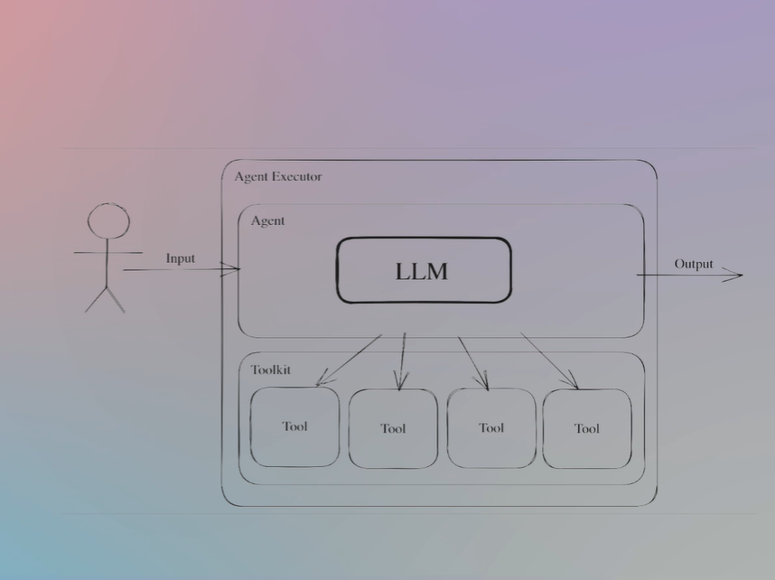

# INTEGRAZIONE DEGLI AGENTI NELL'AMBIENTE DI PRODUZIONE

Abbiamo visto che quando lavoriamo con gli agenti utilizziamo molte chiamate perchè stiamo utilizzando l'LLM come motore di ragionamento.

Ogni step che facciamo ogni tool che utilizziamo deve essere eseguita dopo una chiamata da parte dell'LLM che ha deciso di utilizzare tale tool.

Questo risulterà in molteplici chiamate all'LLM, però non solo avrà molteplici chiamate, tali chiamate saranno sequenziali una dopo l'altra
dove ciascuna di esse attende il risultato di quell precedente.

Questo dipende dalla complessità del nostro task e da quanti step di ragionamento dobbiamo dare, e può convertirsi facilmente in una applicazione di lunga durata.
Dobbiamo tenere questo a mente.

Ci sono alcune soluzioni a questo, come l'utilizzo di una cachè semantica e l'uso di una cache LLM, ma non lo vedremo in questo corso.

## CONTEXT WINDOW

Ora vogliamo parlare del CONTEXT WINDOW.

Abbiamo visto che inviamo un prompt enorme all'LLM ogni volta che facciamo uno step di ragionamento.

Molti LLM possono gestire 32000 tokens che per una applicazione reale si può raggiungere facilmente tale limite.

Cosicché siamo limitati al numero di passi che possiamo dare per via della context window.

Ci sono modelli come Claude di Anthropic che possono ricevere fino a 100k token ma lavorando con tale ammontare di token all'LLM
introduce molti problemi e LLM tende a dimenticare alcune cose nel mezzo. (vedi paper Lost in the Middle)

## HALLUCINATIONS

Quando si invia al LLM una question e LLM risponde con qualcosa non rilevante a tale domanda, perchè l'LLM sta rispondendo inviando un token dopo l'altro.

Il RAG è una tecnica usata per ridurre le allucinazioni, poiché settiamo all'LLM con informazione che inviamo nel contesto.

Comunque, dato che i LLM sono creature statistiche, ciò significa che abbiamo una probabilità di avere la nostra risposta corretta,
e la risposta corretta è in realtà scegliere il tOOL corretto da utilizzare.

Supponiamo che terremo una probabilità di 0.9 di ottenere la risposta corretta che va a scegliere il tool corretto.
Se lo facciamo una sola volta non succede niente poiché è una buona probabilità, tuttavia, se facciamo chiamate sequenziali una dopo l'altra, allora per la legge dei grandi numeri, dopo alcuni steps, ad esempio dopo 6 steps, otteniamo che la probabilità di avere la risposta corretta ovvero di scegliere il TOOL corretto scende fino al 0.59 (0.9 * 0.9 * 0.9 * 0.9 * 0.9 * 0.9)
Questo dopo sole 6 chiamate consecutive.

E se abbiamo un task enorme che fa si che tale probabilità scenda ulteriormente?

Ci sono alcune forme per risolverlo, una di queste è il fine-tuning.

Intendiamo, prendere un LLM e affinarlo per la selezione di tools.

Ci sono paper di ricerca su questo dove le persone fanno il fine-tuning all'LLM per il tool selection.

Quindi invece di avere una probabilità del 90%, la probabilità di ottenere il tool corretto diventa molto più alta perché il modello è fine-tunato con precisione ai tools che l'agente ha disposizione.

## PRICING

Come sappiamo paghiamo per i token che inviamo e riceviamo dall'LLM.

Se stiamo utilizzando agenti, abbiamo visto quanto possono essere grandi i prompts, e quando facciamo questo in scala per milioni allora vedremo che la ricevuta di fatturazione che otterremo sarà molto alta.

GPT-4 ha una grade capacità di ragionamento però funziona molto, molto lentamente ed è molto caro.

Quindi se lo utilizziamo in scala, potremmo arrivare ad una situazione che non ne vale la pena economicamente gestire tali agenti.

Un paio di strategie per risolvere tale problema sono:

1. Usare un tipo di cachè semantica al posto di fare una chiamata all'LLM.
2. Utilizzare il RAG per la selezione dei tool. Non lo vediamo in questo corso ma il RAG per il tools selection si può gestire nel caso in cui abbiamo troppi tools da scegliere.
Cosicché, prima di fare una chiamata all'LLM per il processo di ragionamento, facciamo una ricerca semantica e recuperiamo i tool più rilevanti che hanno un'alta probabilità di essere i tools corretti per noi.

## RESPONSE VALIDATION

Poiché facciamo una chiamata all'LLM e ci stiamo collegando ad esso, e in base alla sua risposta andiamo a scegliere un certo tool oppure da un output per l'utente.

Allora necessitiamo un meccanismo che validi la risposta dell'LLM.

Anche se l'LLM ci risponde correttamente però non è nel formato corretto, allora non va bene.

Testare il modello è una compito molto complesso e non ci sono soluzioni solide a questo problema.

## SECURITY

Nelle applicazioni con gli agenti molto grandi diamo agli LLM capacità di fare alcune cose, ad esempio eseguire chiamate alla base di dati, fare una chiamata alle API o parlare con una persona, e l'agente ha il permesso di fare tutte queste cose. 

Se qualche utente mal intenzionato sequestra il nostro prompt con il prompt injection, o ruba la nostra API key allora potrebbe aver accesso ai nostri tool.

E se la nostra base di dati è proprietaria e non vogliamo esporla, allora siamo nei guai.

La sicurezza è un gran problema e in generale vogliamo attenerci al principio less privilege.

Quindi diamo ai tools e agli agenti i minimi permessi che richiedono. Vogliamo avere un guardrail nei prompt che inviamo agli agenti e permettere o non permettere alcuni tipi di prompt.

Esistono molte soluzioni open-source per questo problema.

È raccomandato utilizzare **LLM Guard**, che offre funzionalità quando si tratta di sicurezza con gli LLM e nell'integrazione di essi nella produzione.

## OVERKILLING

Gli agenti vanno bene quando abbiamo sequenza non deterministica di steps che vogliamo eseguire.

Se sappiamo perfettamente quello che vogliamo eseguire e possiamo definirlo con parole o scrivendo codice, allora non è necessario utilizzare gli agenti.

Vi sono molte person e aziende che provano ad ottenere qualcosa con gli agenti LLM, dove invece la soluzione più robusta era semplicemente implementare un codice deterministico in python che facesse quello che gli era richiesto.

Quindi il consiglio è che prima di usare gli agenti, pensare se si può implementare un codice deterministico per ottenere quello che vogliamo. 
Se si può usare un codice deterministico allora non è consigliabile usare gli agenti, poichè, come abbiamo visto, hanno molte cose da impostare, testare e monitorare.

## CONCLUSIONE

Gli agenti sono una tecnologia straordinaria e hanno un enorme potenziale per ottenere gradi risultati.

Tuttavia, non è semplice passare dal prototipo ad una applicazione di produzione.

È completamente fattibile, però ha molte sfide. 

